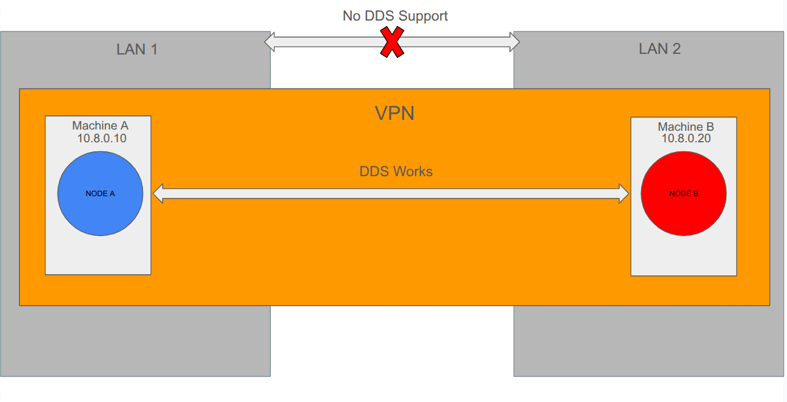

# ROS2 VPN Bridge
I set up a VPN for two ROS systems on diffrent locations(as part of a small robotics project) a while ago, and I finally got bored enough to document it.

- [Overview](#overview)
- [General Idea](#general-idea)
- [VPN Server Config](#vpn-server-side)
- [ROS System Config](#ros-client-side)
- [Run The Nodes](#run-nodes)
- [What's next](#final-words)

## Overview 
Imagine you're working with `two ROS 2 systems` sitting behind `two separate NATs`.
As you might know, ROS 2 uses DDS for exchanging data between nodes. It relies on UDP multicast discovery to establish connections.

The problem is that this setup works only in a `LAN environment`. There are multiple ways to work around this, but before we get to them, let’s look at a simple example:
You have a robot in a robotics lab, and you want to monitor its data or actuate it remotely from anywhere on the planet. This is when you need a `VPN` to merge the two systems onto the same virtual LAN.
There are faster and more efficient ways to solve this issue, only if your service provider offers static IP internet plans(which not many do, and when they do, it’s not that cheap). Under this condition, one alternative solution would be an extension of this repo: [ros2-socketcomm](https://github.com/AmirrezaRamesh/ros2-socketcomm), combined with a simple port forwarding set on the routers.
> If you don't need ROS functionality on both systems, and both of them sitting behind NATs, a combination of current repo and [ros2-socketcomm](https://github.com/AmirrezaRamesh/ros2-socketcomm) is suggested. Meaning you setup a VPN and let the clients talk to each other, but the messaging is not ROS standard and you can use raw tcp! There is also a better way that I found recently(hint: it's Zenoh),but I haven't had the time to check it out!

## General Idea
To get started, you need:
- Two Machines with ROS installed on them(as mentioned, on seprate NATs)

- A VPS as the VPN server

- A good reason to waste your time

Steps:

1. Simply set up the VPN server on the VPS(Ubuntu 22.04 server)

2. Add the ROS systems into your virtual network

3. Configure and modify ROS middleware(Cyclone DDS) to work over VPN

4. Write two simple nodes on the machines and test if they can communicate

5. Expand the project based on your needs



## walkthrough

### VPN server side: 

1. Install packages on VPS using:
```bash 
sudo apt update
sudo apt install -y openvpn easy-rsa ufw 
```
2. Move the script `setup_pki.sh` located in VPN directory onto the VPS and run the script to PKI with easy-rsa

3. Move the file `server.conf` located in VPN directory onto the VPS path: `/etc/openvpn/server/server.conf`

4. Run the command to define rules/IPs for clients:
```bash
sudo mkdir -p /etc/openvpn/ccd
echo "ifconfig-push 10.8.0.10 255.255.255.0" | sudo tee /etc/openvpn/ccd/clientA
echo "ifconfig-push 10.8.0.20 255.255.255.0" | sudo tee /etc/openvpn/ccd/clientB
```
5. Enable tunnel and modify firewall:
```bash
echo 'net.ipv4.ip_forward=1' | sudo tee /etc/sysctl.d/99-openvpn.conf
sudo sysctl --system

sudo ufw allow 1194/udp
sudo ufw allow OpenSSH
sudo ufw enable 
```
6. Start vpn server:
```bash
sudo systemctl enable --now openvpn-server@server.service
sudo systemctl status openvpn-server@server.service
```
7. Create client profiles:
```bash
mkdir -p ~/ovpn_clients/clientA ~/ovpn_clients/clientB
```

8. Move the files with the .opvn files from VPN directory to paths:
`~/ovpn_clients/clientA/clientA.ovpn` and `~/ovpn_clients/clientB/clientB.ovpn`
We didn't need to have the .opvn files on the server side but its a good idea to have them there, and change them if needed, and overwrite the client files.

### ROS client side:
1. Use `scp` or any other methods to copy the each .opvn file on its target Machine(I copied on ~ directory).

2. Install packages and connect
Machine A:
```bash
sudo apt update
sudo apt install -y openvpn

sudo openvpn --config ~/clientA.ovpn

sudo mkdir -p /etc/openvpn/client
sudo cp ~/clientA.ovpn /etc/openvpn/client/clientA.conf
sudo systemctl enable --now openvpn-client@clientA.service
```
Machine B:
```bash
sudo apt update
sudo apt install -y openvpn

sudo openvpn --config ~/clientA.ovpn

sudo mkdir -p /etc/openvpn/client
sudo cp ~/clientA.ovpn /etc/openvpn/client/clientA.conf
sudo systemctl enable --now openvpn-client@clientA.service
```

3. Test the connection on Machine A(and Machine B if you want):
```bash
ping -c 10 10.8.0.1 #Server

ping -c 10 10.8.0.20 #Machine B
```
If you could ping them, the VPN set up is done correctly!

For some reason, mutilcasting doesn't work over VPN, so we use unicasting.meaning a peer to peer clients' connection(kinda embrassing!):

4. Put the `DDS_client(A/B).xml` files in this `path` and `name` for both machines: `~/.ros/cyclonedds.xml`

5. Put this lines inside your `.bashrc` of both machines:
```bash
export RMW_IMPLEMENTATION=rmw_cyclonedds_cpp
export CYCLONEDDS_URI=file://$HOME/.ros/cyclonedds.xml
export ROS_DOMAIN_ID=69 
```

> You can automate the process of starting server/clients on boot which is a fairly easy task for chatgpt

### Run Nodes

0. Make sure all services mentioned earlier are running.

1. Use the two Python files in the ROS directory inside the packages built on each machine, and modify setup.py and package.xml accordingly.

2. Machine A: `ros2 run package_name clientA`

3. Machine B: `ros2 run package_name clientB`

4. Expetected output on Machine A: `Sending my regards to Machine B:VPN worked!` every one second.

5. Expected output on Machine B: `Receiving Machine A regards:VPN worked!` every one second.

> Now you can (but you won't XD) use your nodes within this architecture.

### Final Words
As you will probably notice, the connection is not very fast, and there are noticeable delays, which I assume will increase as the data size grows. Therefore, this may not be the best option for lossy networks or robots operating in real time. However, it works well for certain development purposes.

> P.S. This project was only tested once in the simplest way, and I wasn’t motivated enough to expand it. In a real project, it’s definitely buggy. So, if anyone ever wants to try this setup out (what are the chances, XD), please contact me first at `rameshamirreza3@gmail.com`. I already have some improvements in mind.
